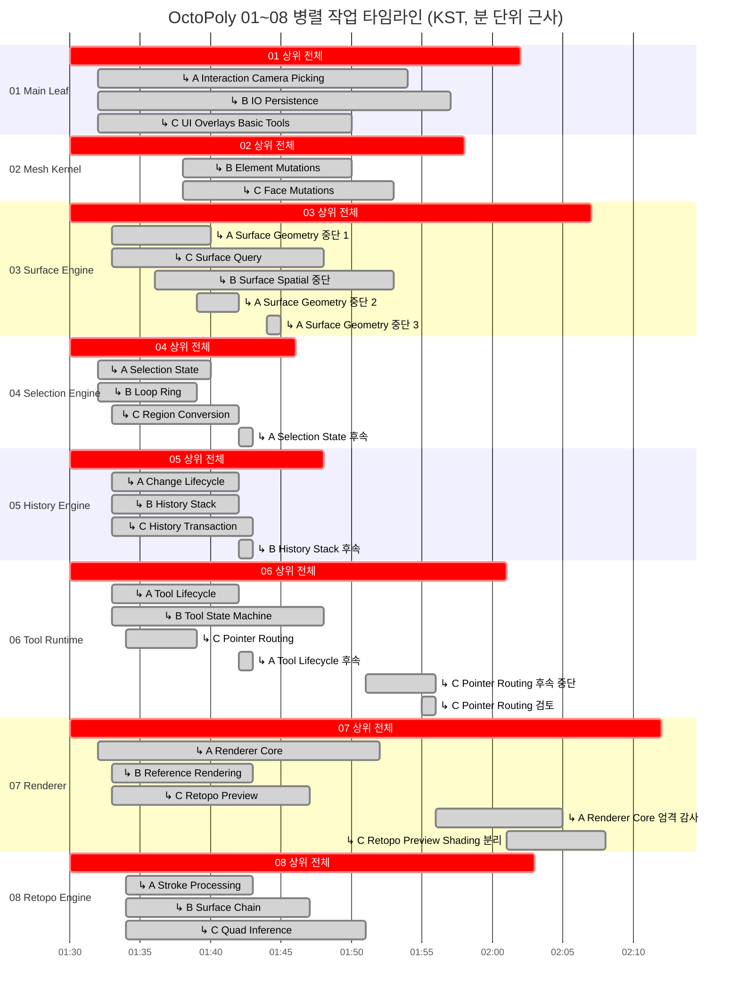

# OctoPoly 01~08 작업 소요 시간 및 병렬 타임라인

## 데이터 기준

- 시각은 Codex 대화 메타데이터의 Unix epoch를 `Asia/Seoul`로 변환한 KST 기준이다.
- 상위 작업의 시작·종료는 구현 turn의 `startedAt`과 `completedAt`이다.
- 대화 `createdAt`이 실제 turn 시작과 달라 별도 열에 기록했다.
- 소요 시간은 `durationMs`를 사용했으며 `hh:mm:ss.mmm (원시 초)` 형식으로 표시한다.
- 하위 작업은 명시적으로 생성된 서브에이전트 turn만 포함한다.
- `turn_aborted`도 정확한 시작·종료·소요 메타데이터가 있으면 `[중단]`으로 포함했다. 이는 작업 완료를 의미하지 않는다.
- 주 에이전트 내부의 조사, 조립, 검증, commit/push 단계에는 독립적인 시작·종료 메타데이터가 없어 하위 구간을 추정하지 않았다.
- Mermaid로 계층과 병렬 구간을 충분히 표현할 수 있어 PNG는 생성하지 않았다.

## 01~08 상위 작업

| 번호 | 작업 | 브랜치 | 생성(KST) | 시작(KST) | 종료(KST) | 소요 | Commit |
|---:|---|---|---|---|---|---:|---|
| 01 | Main Leaf | `wt/main-leaf` | 2026-08-10 01:30:10 | 2026-08-10 01:30:14 | 2026-08-10 02:01:19 | 00:31:05.232 (1,865.232초) | `ad02fc78e8db23989f86107d8aa827be07dc3b53` |
| 02 | Mesh Kernel | `wt/mesh-kernel` | 2026-08-10 01:30:10 | 2026-08-10 01:30:14 | 2026-08-10 01:58:03 | 00:27:48.671 (1,668.671초) | `9e294defe66bed96bd00829976bc7412b5990c38` |
| 03 | Surface Engine | `wt/surface-engine` | 2026-08-10 01:30:15 | 2026-08-10 01:30:19 | 2026-08-10 02:06:34 | 00:36:15.387 (2,175.387초) | `ff8492d8b359c1ad9482877cdbce80e059eba313` |
| 04 | Selection Engine | `wt/selection-engine` | 2026-08-10 01:30:15 | 2026-08-10 01:30:19 | 2026-08-10 01:45:41 | 00:15:22.516 (922.516초) | `726946689602c5b1df46e16ff5bb1aa5a87fb8fd` |
| 05 | History Engine | `wt/history-engine` | 2026-08-10 01:30:17 | 2026-08-10 01:30:21 | 2026-08-10 01:47:36 | 00:17:15.111 (1,035.111초) | `ec8f76ef2d1ea5a8f0da2eab4acb7eb9b9da6439` |
| 06 | Tool Runtime | `wt/tool-runtime` | 2026-08-10 01:30:20 | 2026-08-10 01:30:24 | 2026-08-10 02:00:30 | 00:30:06.132 (1,806.132초) | `1fb97aa69656409005db49de9ed9fdd2ca51aa21` |
| 07 | Renderer | `wt/renderer` | 2026-08-10 01:30:23 | 2026-08-10 01:30:25 | 2026-08-10 02:11:57 | 00:41:32.480 (2,492.480초) | `ccf90912bf2f166019dffa7c8dfe82fed15ef866` |
| 08 | Retopo Engine | `wt/retopo-engine` | 2026-08-10 01:30:24 | 2026-08-10 01:30:25 | 2026-08-10 02:02:30 | 00:32:04.960 (1,924.960초) | `7169bc130b200a1010428ff6b69696355ee17663` |

## 병렬 실행 요약

- 전체 병렬 실행 구간: `2026-08-10 01:30:14` ~ `2026-08-10 02:11:57 KST`
- 실제 벽시계 시간: `00:41:43` — 2,503초
- 상위 8개 작업 단순 합산: `03:51:30.489` — 13,890.489초
- 병렬화로 절약된 이론상 벽시계 시간: `03:09:47.489` — 11,387.489초
- 직렬 합산 대비 단축률: 약 `81.98%`
- 관측 병렬 배율: 약 `5.55×`

계산식:

```text
벽시계 시간 = max(completedAt) - min(startedAt)
            = 1786295517 - 1786293014
            = 2,503초

단순 합산 = Σ durationMs / 1000
          = 13,890.489초

절약 시간 = 단순 합산 - 벽시계 시간
          = 11,387.489초
```

하위 작업 소요는 상위 turn 안에 포함되어 있으므로 위 단순 합산에 다시 더하지 않았다.

## 세부 구간

| 상위 | 세부 작업 | 시작(KST) | 종료(KST) | 소요 | 근거 |
|---:|---|---|---|---:|---|
| 01 | ↳ A — Interaction / Camera / Picking | 2026-08-10 01:32:18 | 2026-08-10 01:53:54 | 00:21:35.694 (1,295.694초) | `task_complete`; thread `019fe75e-31b9-7993-b057-97dabe78ddf4`; turn `019fe75e-33bb-7210-a3e1-6fb735769931` |
| 01 | ↳ B — IO / Persistence | 2026-08-10 01:32:26 | 2026-08-10 01:56:48 | 00:24:22.244 (1,462.244초) | `task_complete`; thread `019fe75e-50d2-7a80-827d-8aafd10a6d47`; turn `019fe75e-5237-7610-8bed-9386a55d5684` |
| 01 | ↳ C — UI / Overlays / Basic Tools | 2026-08-10 01:32:38 | 2026-08-10 01:49:46 | 00:17:07.569 (1,027.569초) | `task_complete`; thread `019fe75e-80ba-79b1-a8b8-2dc23a8ed696`; turn `019fe75e-821f-7002-b5a8-cee590a95fea` |
| 02 | ↳ B — Element Mutations | 2026-08-10 01:38:08 | 2026-08-10 01:49:26 | 00:11:17.841 (677.841초) | `task_complete`; thread `019fe763-8b16-7c10-8fb6-cedbdb3fae6f`; turn `019fe763-8c51-7b33-8502-85fa35c55672` |
| 02 | ↳ C — Face Mutations | 2026-08-10 01:38:16 | 2026-08-10 01:52:23 | 00:14:07.208 (847.208초) | `task_complete`; thread `019fe763-a973-7093-9286-db82c3c0d256`; turn `019fe763-aae8-76e1-9cda-dab38d9fd0f2` |
| 03 | ↳ A — Surface Geometry [중단] | 2026-08-10 01:33:02 | 2026-08-10 01:39:35 | 00:06:32.786 (392.786초) | `turn_aborted`; thread `019fe75e-dfdb-7330-8760-ea9665e45acc`; turn `019fe75e-e15e-7241-a7f3-b5e679b52b9b` |
| 03 | ↳ C — Surface Query | 2026-08-10 01:33:13 | 2026-08-10 01:47:30 | 00:14:16.812 (856.812초) | `task_complete`; thread `019fe75f-08b1-7b03-ac00-5683dca43e92`; turn `019fe75f-09ea-7413-817b-860154a91281` |
| 03 | ↳ B — Surface Spatial [중단] | 2026-08-10 01:36:13 | 2026-08-10 01:52:27 | 00:16:13.705 (973.705초) | `turn_aborted`; thread `019fe761-c95e-71d2-984a-565800428418`; turn `019fe761-cb59-7931-a673-b94e27bae7b5` |
| 03 | ↳ A — Surface Geometry #2 [중단] | 2026-08-10 01:39:43 | 2026-08-10 01:41:46 | 00:02:03.049 (123.049초) | `turn_aborted`; thread `019fe75e-dfdb-7330-8760-ea9665e45acc`; turn `019fe764-ffad-7a51-af8a-043420c712cd` |
| 03 | ↳ A — Surface Geometry #3 [중단] | 2026-08-10 01:44:25 | 2026-08-10 01:44:44 | 00:00:18.796 (18.796초) | `turn_aborted`; thread `019fe75e-dfdb-7330-8760-ea9665e45acc`; turn `019fe769-4b55-7612-8263-6048d7f8b5d8` |
| 04 | ↳ A — Selection State | 2026-08-10 01:32:44 | 2026-08-10 01:40:20 | 00:07:36.695 (456.695초) | `task_complete`; thread `019fe75e-96f5-7061-80c3-9c9451cd9eb8`; turn `019fe75e-985c-7650-a22d-7fab0add981c` |
| 04 | ↳ B — Loop / Ring | 2026-08-10 01:32:53 | 2026-08-10 01:39:47 | 00:06:54.687 (414.687초) | `task_complete`; thread `019fe75e-ba19-7cc2-82ed-e43dc1efaab5`; turn `019fe75e-bb9d-7fc3-82d8-51b0b044c5ff` |
| 04 | ↳ C — Region Conversion | 2026-08-10 01:33:00 | 2026-08-10 01:41:19 | 00:08:18.653 (498.653초) | `task_complete`; thread `019fe75e-d6b5-7b51-8628-ffc6dee36e86`; turn `019fe75e-d820-7181-a519-4b4079d78566` |
| 04 | ↳ A — Selection State #2 | 2026-08-10 01:42:02 | 2026-08-10 01:42:39 | 00:00:36.725 (36.725초) | `task_complete`; thread `019fe75e-96f5-7061-80c3-9c9451cd9eb8`; turn `019fe767-1db7-76a2-8040-9efbb1a53507` |
| 05 | ↳ A — Change Lifecycle | 2026-08-10 01:33:32 | 2026-08-10 01:41:36 | 00:08:03.831 (483.831초) | `task_complete`; thread `019fe75f-55af-72e3-8518-983c2e96abf1`; turn `019fe75f-5717-7370-b9bf-8d65cfd512ce` |
| 05 | ↳ B — History Stack | 2026-08-10 01:33:40 | 2026-08-10 01:41:54 | 00:08:14.144 (494.144초) | `task_complete`; thread `019fe75f-73b7-7c92-9e4c-70b144f61825`; turn `019fe75f-75a1-7541-856f-7c40f9e74f76` |
| 05 | ↳ C — History Transaction | 2026-08-10 01:33:52 | 2026-08-10 01:43:29 | 00:09:37.871 (577.871초) | `task_complete`; thread `019fe75f-a045-7322-a418-0b592b21671d`; turn `019fe75f-a1a5-7b32-a43a-87066b58d470` |
| 05 | ↳ B — History Stack #2 | 2026-08-10 01:42:30 | 2026-08-10 01:43:15 | 00:00:44.625 (44.625초) | `task_complete`; thread `019fe75f-73b7-7c92-9e4c-70b144f61825`; turn `019fe767-8be3-7301-a39f-55a757cbfa11` |
| 06 | ↳ A — Tool Lifecycle | 2026-08-10 01:33:48 | 2026-08-10 01:42:01 | 00:08:12.614 (492.614초) | `task_complete`; thread `019fe75f-91ad-7200-840b-a0bee10e5afe`; turn `019fe75f-938e-7972-b3b1-3bd1ac26b2b4` |
| 06 | ↳ B — Tool State Machine | 2026-08-10 01:33:55 | 2026-08-10 01:48:22 | 00:14:26.830 (866.830초) | `task_complete`; thread `019fe75f-af09-72b0-94f8-045a990cf559`; turn `019fe75f-b089-72a1-af40-9903c7efa9ee` |
| 06 | ↳ C — Pointer Routing | 2026-08-10 01:34:04 | 2026-08-10 01:38:49 | 00:04:44.566 (284.566초) | `task_complete`; thread `019fe75f-d0ea-7eb2-92b8-ff4872e0ffb9`; turn `019fe75f-d349-7aa3-a4c5-13ace50b9b76` |
| 06 | ↳ A — Tool Lifecycle #2 | 2026-08-10 01:42:20 | 2026-08-10 01:43:09 | 00:00:49.653 (49.653초) | `task_complete`; thread `019fe75f-91ad-7200-840b-a0bee10e5afe`; turn `019fe767-631b-7982-96d1-a8e5eca35ae2` |
| 06 | ↳ C — Pointer Routing #2 [중단] | 2026-08-10 01:51:19 | 2026-08-10 01:55:24 | 00:04:05.090 (245.090초) | `turn_aborted`; thread `019fe75f-d0ea-7eb2-92b8-ff4872e0ffb9`; turn `019fe76f-9ba2-7872-ba13-7817b038e536` |
| 06 | ↳ C — Pointer Routing #3 | 2026-08-10 01:55:28 | 2026-08-10 01:55:49 | 00:00:21.215 (21.215초) | `task_complete`; thread `019fe75f-d0ea-7eb2-92b8-ff4872e0ffb9`; turn `019fe773-685c-7b92-83ad-fcbb48c49b01` |
| 07 | ↳ A — Renderer Core | 2026-08-10 01:32:55 | 2026-08-10 01:52:48 | 00:19:53.313 (1,193.313초) | `task_complete`; thread `019fe75e-c354-7482-a6d0-9e13dfd667d4`; turn `019fe75e-c4ba-7a72-b888-1e67f94f2d6c` |
| 07 | ↳ B — Reference Rendering | 2026-08-10 01:33:04 | 2026-08-10 01:42:44 | 00:09:39.356 (579.356초) | `task_complete`; thread `019fe75e-e7b6-79d3-a4dd-ac3486bb2cb4`; turn `019fe75e-e968-7e03-a83a-100cfc3c1199` |
| 07 | ↳ C — Retopo / Preview | 2026-08-10 01:33:15 | 2026-08-10 01:47:03 | 00:13:48.100 (828.100초) | `task_complete`; thread `019fe75f-1127-7c20-94e1-625795a2924d`; turn `019fe75f-1285-7411-92bd-15cb537755f3` |
| 07 | ↳ A — Renderer Core #2 | 2026-08-10 01:56:13 | 2026-08-10 02:04:45 | 00:08:31.680 (511.680초) | `task_complete`; thread `019fe75e-c354-7482-a6d0-9e13dfd667d4`; turn `019fe774-19b0-78a0-82b2-dd4b9b24a81e` |
| 07 | ↳ C — Retopo / Preview #2 | 2026-08-10 02:01:03 | 2026-08-10 02:07:44 | 00:06:41.030 (401.030초) | `task_complete`; thread `019fe75f-1127-7c20-94e1-625795a2924d`; turn `019fe778-8614-7631-aadd-b6d2ce4f5dad` |
| 08 | ↳ A — Stroke Processing | 2026-08-10 01:34:10 | 2026-08-10 01:42:47 | 00:08:37.312 (517.312초) | `task_complete`; thread `019fe75f-e620-7632-9031-fff5bfbd6d7a`; turn `019fe75f-e7ff-7491-8757-70b698abd2bc` |
| 08 | ↳ B — Surface Chain | 2026-08-10 01:34:18 | 2026-08-10 01:46:27 | 00:12:08.459 (728.459초) | `task_complete`; thread `019fe760-08d5-7de1-b1a5-e02cb2a8f0d0`; turn `019fe760-0a2d-7a12-a70b-c2330832b1cd` |
| 08 | ↳ C — Quad Inference | 2026-08-10 01:34:27 | 2026-08-10 01:50:54 | 00:16:26.650 (986.650초) | `task_complete`; thread `019fe760-2b96-7661-864f-cc8cb64a4c3f`; turn `019fe760-2d09-7b81-a04a-f7be433e4838` |

## Mermaid Gantt

범례:

- `crit` 강조 막대 = 01~08 상위 작업 전체 turn
- `↳` 흐린 `done` 막대 = 하위 작업 turn
- `[중단]` = 정확한 `turn_aborted` 구간이며 완료 작업이 아님
- 하위 작업의 `done`은 흐린색 표시를 위한 Mermaid 표준 스타일일 뿐, 실행 상태는 라벨과 세부 구간 표를 기준으로 한다.
- Mermaid 렌더러 간 호환성을 위해 시작은 해당 분으로 내림하고 소요 시간은 다음 정수 분으로 올렸다. 정확한 초·밀리초는 표가 기준이다.
- 막대 두께나 opacity를 강제하는 비표준 CSS는 사용하지 않았다. 렌더러가 `done` 색상을 바꾸더라도 `↳` 라벨로 계층을 구분할 수 있다.



## 상위 Thread 원본 메타데이터

각 행은 해당 Codex session의 `createdAt`과 구현 turn의 완료 이벤트에서 가져왔다.

| 번호 | Thread | Turn | createdAt (UTC) | startedAt epoch | completedAt epoch | durationMs |
|---:|---|---|---|---:|---:|---:|
| 01 | `019fe75c-3e15-7bb2-bf08-628f23fb1cb5` | `019fe75c-4fbe-7d10-be8f-78f308a909d2` | `2026-08-09T16:30:10.068Z` | 1786293014 | 1786294879 | 1865232 |
| 02 | `019fe75c-3e16-7050-842a-19c2467a6cba` | `019fe75c-503b-7412-87f2-98e53eb4ab39` | `2026-08-09T16:30:10.061Z` | 1786293014 | 1786294683 | 1668671 |
| 03 | `019fe75c-54be-7ff0-9661-12568181f32f` | `019fe75c-6346-7cd2-9c47-e8989df08ba1` | `2026-08-09T16:30:15.919Z` | 1786293019 | 1786295194 | 2175387 |
| 04 | `019fe75c-54c2-7b63-8939-4f96b2ee3a9b` | `019fe75c-62a9-7ba2-b648-0da7c5677b06` | `2026-08-09T16:30:15.900Z` | 1786293019 | 1786293941 | 922516 |
| 05 | `019fe75c-5c5a-7160-8119-751a4ff1525e` | `019fe75c-6ba9-7ff1-a03d-b8d7438a16e7` | `2026-08-09T16:30:17.759Z` | 1786293021 | 1786294056 | 1035111 |
| 06 | `019fe75c-66eb-7d53-9f5b-0aca9d56abe0` | `019fe75c-7599-78d1-89bc-d54e772232da` | `2026-08-09T16:30:20.475Z` | 1786293024 | 1786294830 | 1806132 |
| 07 | `019fe75c-74a2-7973-8838-fc6d8cf47f85` | `019fe75c-7a8b-7953-9373-961d65648195` | `2026-08-09T16:30:23.997Z` | 1786293025 | 1786295517 | 2492480 |
| 08 | `019fe75c-76fe-7ef3-96ac-a184a7c44b52` | `019fe75c-7c49-7850-9176-4f5013d94586` | `2026-08-09T16:30:24.596Z` | 1786293025 | 1786294950 | 1924960 |

## 계산 방법과 한계

- `startedAt`과 `completedAt`은 초 단위 Unix epoch이고 `durationMs`는 밀리초 단위다. 표시된 시작·종료의 단순 차이와 `durationMs` 사이에는 최대 약 1초 차이가 생길 수 있으며 소요 시간에는 더 정밀한 `durationMs`를 사용했다.
- `durationMs`는 Codex turn의 벽시계 시간이다. 추론, 도구 실행, 테스트, 명령 대기 및 서브에이전트 대기가 포함될 수 있으며 CPU 사용 시간이나 순수 코딩 시간은 아니다.
- 병렬 절약 시간은 동일 작업을 같은 소요 시간으로 완전히 직렬 실행한다고 가정한 이론값이다. 실제 직렬 실행에서는 캐시, 자원 경합, 조정 비용이 달라질 수 있다.
- 하위 작업의 중첩 시간은 상위 turn에 이미 포함되어 있다. 상위·하위 시간을 합산하면 중복 계산이 된다.
- `turn_aborted` 구간은 시작·종료·소요가 객관적으로 기록되어 있어 표시했지만, 해당 turn이 결과를 완성했다는 뜻은 아니다.
- 명시적인 서브에이전트 turn 외의 주 에이전트 내부 세부 단계에는 독립적인 종료 메타데이터가 없다. commentary나 명령 시각으로 임의의 구간을 만들지 않았다.
