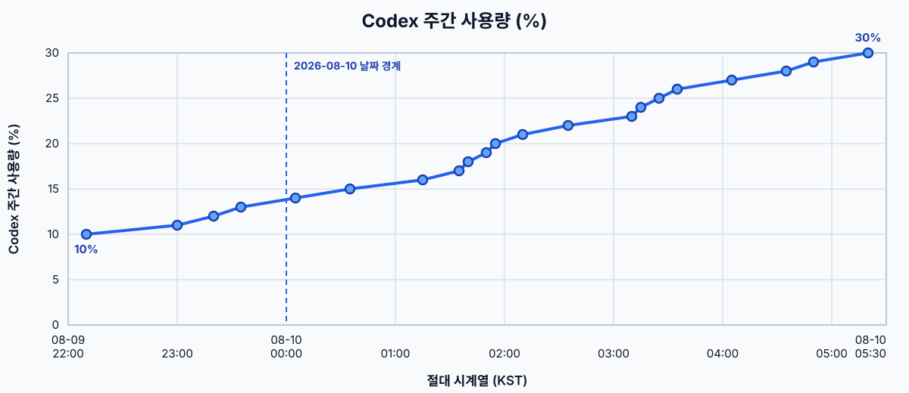

# OctoPoly 전체 작업 소요 시간 및 타임라인

기록 스냅샷: `2026-08-10 17:04:47 KST`

## 데이터 기준

- 이 문서는 최초 계획 ZIP 검토부터 현재까지 확인된 OctoPoly 전체 작업을 기록한다.
- 시각은 Codex 대화 메타데이터의 Unix epoch와 Git commit 시각을 `Asia/Seoul`로 변환한 KST 기준이다.
- 표의 시작·종료는 초 단위까지 기록한다. 소요 시간은 `durationMs`의 밀리초를 버린 `hh:mm:ss (정수 초)` 형식이다.
- Mermaid는 모든 막대에 절대 시작 시각과 소요 시간을 사용한다. `after` 문법을 쓰지 않으므로 작업 사이 유휴 시간은 가로 시간축에서 빈 공간으로 남는다.
- 상위 작업은 진한 블루, 하위·보조 작업은 같은 계열의 밝고 채도 있는 블루로 표시한다. Mermaid의 `crit` 색상도 블루로 덮어써 빨간색을 사용하지 않는다.
- 하위 작업은 명시적으로 생성된 서브에이전트 turn만 포함한다. 주 에이전트 내부 단계를 임의로 분할하지 않는다.
- `turn_aborted`도 정확한 시작·종료 메타데이터가 있으면 `[중단]`으로 표시한다. 이는 작업 완료를 의미하지 않는다.
- 10~14는 상위 task의 실제 시작·종료 메타데이터만 표시한다. 정확한 시각이 없는 내부 단계를 임의로 세분하지 않는다.
- 14는 통합, 회귀 검증, commit·push까지 끝났지만 실제 iPad/Pencil 증거가 없어 검증 상태가 `BLOCKED`다. 이는 구현 또는 push가 미완료라는 의미가 아니다.
- 16~18은 동일한 exact `POST_PLAN_BASE_SHA`에서 생성한 독립 worktree/Hermes 세션의 시작 시각을 사용한다.
  API 중단 뒤 같은 세션을 재개한 시간도 상위 작업의 벽시계 구간에 포함한다. 완료 시각은 RESULT commit과
  원격 branch tip 검증이 끝난 checkpoint를 사용하고, 미완료 작업은 snapshot 시각에서 막대를 자른다.
- Mermaid로 계층, 병렬 구간, 유휴 구간을 표현할 수 있어 별도 PNG는 생성하지 않았다.

## 대화 시작 이후 전체 구간

| 구간 | 활동 | 시작(KST) | 종료(KST) | 소요 | 상태 | 근거 |
|---|---|---|---|---:|---|---|
| P00 | 최초 ZIP 검토 요청 | 2026-08-09 22:35:23 | 2026-08-09 22:35:28 | 00:00:04 (4초) | 중단 | main thread / turn `019fe6bc-3b13…` |
| P01 | ZIP 압축 해제, 18개 계획 문서 검토, 설계 의견 작성 | 2026-08-09 22:35:38 | 2026-08-09 22:38:45 | 00:03:07 (187초) | 완료 | main thread / turn `019fe6bc-74b0…` |
| P02 | 저장소 루트 `AGENTS.md` 생성 | 2026-08-09 22:39:12 | 2026-08-09 22:43:03 | 00:03:51 (231초) | 완료 | main thread / turn `019fe6bf-b85b…` |
| P03 | 경로 정리, 중첩 폴더 제거, README·AGENTS·설계 문서 통합 검토·수정·커밋·푸시 | 2026-08-09 22:44:50 | 2026-08-10 00:14:08 | 01:29:17 (5,357초) | 완료 | main thread / turn `019fe6c4-e20e…` |
| Q01 | 00 수행 위치 확인 답변 | 2026-08-10 00:14:41 | 2026-08-10 00:15:01 | 00:00:19 (19초) | 답변 | main thread / turn `019fe717-24dc…` |
| Q02 | 00 이후 01~08 대화 생성 가능 여부 답변 | 2026-08-10 00:15:34 | 2026-08-10 00:15:52 | 00:00:17 (17초) | 답변 | main thread / turn `019fe717-f4d7…` |
| B00-A | 00 Bootstrap 후보 구현, 로컬 검증, Pages 상태 점검, 후보 커밋·푸시 | 2026-08-10 00:16:08 | 2026-08-10 00:51:19 | 00:35:11 (2,111초) | 외부 설정 대기 | main thread / turn `019fe718-7805…` |
| B00-B | Cloudflare Pages 수동 설정 안내 | 2026-08-10 01:20:55 | 2026-08-10 01:21:47 | 00:00:52 (52초) | 답변 | main thread / turn `019fe753-c80c…` |
| B00-C | Pages 재검증, Bootstrap baseline 확정, 태그·푸시, 01~08 생성 | 2026-08-10 01:23:50 | 2026-08-10 01:31:25 | 00:07:35 (455초) | 완료 | main thread / turn `019fe756-723b…` |
| Q03 | 01~08 이후 09 자동 시작 방식 설명 | 2026-08-10 01:55:18 | 2026-08-10 01:56:10 | 00:00:51 (51초) | 답변 | main thread / turn `019fe773-4149…` |
| Q04 | 10~15 선행 관계 설명 | 2026-08-10 01:57:34 | 2026-08-10 01:59:01 | 00:01:27 (87초) | 답변 | main thread / turn `019fe775-5543…` |
| Q05 | 02·04·05 조기 merge 가능 여부 설명 | 2026-08-10 01:59:17 | 2026-08-10 01:59:36 | 00:00:19 (19초) | 답변 | main thread / turn `019fe776-e816…` |
| C01 | 01~08 감시, 09 생성·감시, 첫 타임라인 작성, 10~13 생성 | 2026-08-10 02:02:55 | 2026-08-10 03:13:14 | 01:10:17 (4,217초) | 완료 | main thread / turn `019fe77a-3b51…` |
| C02 | 14 감시, 사용량 그래프, 후속 기능·상용화 분석, 16~18 계획, 독립 감사와 handoff | 2026-08-10 03:39:55 | 2026-08-10 05:20:00 | 01:40:05 (6,005초) | 체크포인트 | main thread / turn `019fe7d3-0a60…` |
| I09 | 09 Core Integration | 2026-08-10 02:13:17 | 2026-08-10 03:04:30 | 00:51:11 (3,071초) | 완료 | thread `019fe783-b493-70d0-9887-f4f1cf543946` |
| O10 | 10 UV Editor | 2026-08-10 03:06:04 | 2026-08-10 03:36:05 | 00:30:00 (1,800초) | 완료 | thread `019fe7b3-f9bc-7bd0-a68a-39cbd9c840da` |
| O11 | 11 Texture Paint | 2026-08-10 03:06:08 | 2026-08-10 04:09:22 | 01:03:14 (3,794초) | 완료 | thread `019fe7b4-1196-7cb1-b89e-5e49d9c820e7` |
| O12 | 12 Lookdev / PBR | 2026-08-10 03:06:08 | 2026-08-10 03:34:17 | 00:28:08 (1,688초) | 완료 | thread `019fe7b4-1296-7ed2-9757-0710f0ece551` |
| O13 | 13 MatCap | 2026-08-10 03:06:10 | 2026-08-10 03:35:53 | 00:29:42 (1,782초) | 완료 | thread `019fe7b4-1f7b-7bb2-9e19-78cae3654c43` |
| O14 | 14 Optional Integration | 2026-08-10 04:10:33 | 2026-08-10 04:54:25 | 00:43:52 (2,632초) | `BLOCKED` — 통합·회귀·push 완료, 실제 iPad/Pencil 증거 없음 | thread `019fe7ef-1068-7f42-82f4-ecf6f2e5793c` |
| F16-A | 16 Basic Primitives — Plane/Cube | 2026-08-10 15:11:31 | 2026-08-10 16:10:09 | 00:58:38 (3,518초) | 완료 | Hermes `20260810_151133_a032f7`; RESULT `28cd1aa` |
| F17-E | 17 Guided Retopo — Early Core | 2026-08-10 15:11:31 | 2026-08-10 16:49:59 | 01:38:28 (5,908초) | Early Core 완료 / 전체 `IN_PROGRESS` | Hermes `20260810_151133_cd9dc8`; RESULT `d142ca6` |
| F18 | 18 Desktop Mouse Camera | 2026-08-10 15:11:31 | 2026-08-10 16:54:53 | 01:43:22 (6,202초) | 자동·브라우저 검증 완료 / 물리 입력 evidence 대기 | Hermes `20260810_151133_3048a9`; RESULT `9cc9c79` |
| F16-B | 16 Built-in Animal Meshes + default-Cube handoff | 2026-08-10 16:17:43 | 2026-08-10 16:56:01 | 00:38:18 (2,298초) | 완료 | Hermes `20260810_151133_a032f7`; feature `4d441b6`; RESULT `165508b` |

`C01`과 `C02`는 각각 하나의 assistant turn에서 여러 활동을 수행했다. 독립된 시작·종료 메타데이터가 없는
내부 활동을 임의로 분할하지 않았다. `C02`의 종료는 사용자가 제공한 `05:20 30%` 현시점과 취침 전 handoff
체크포인트에 맞춘 것이며 active turn의 최종 종료 시각을 뜻하지 않는다. 별도 대화인 `I09`와 `O10~O14`는
자체 turn 메타데이터가 있어 독립 행으로 함께 표시한다.

## 문서·규칙 변경 milestone

| 시각(KST) | Commit | 변경 |
|---|---|---|
| 2026-08-09 22:43:50 | `d68f23e17ca164ff411faa80adf9fc23aff5188a` | 압축 원본의 초기 계획 문서와 AGENTS 반영 |
| 2026-08-10 00:12:55 | `3d5dca9023f223e6bd1d165a2bea4e401bada3f0` | 중첩 경로 제거, README 통합, 병렬 개발 및 Pages 계획 정비 |
| 2026-08-10 00:22:07 | `901311236cf2fe1d21077648b1a0cb36f45d9e3d` | 디자인 자산 ImageGen 사용 지침 추가 |
| 2026-08-10 00:27:51 | `8d137da5adea73c4661f2eb4d97ccfe1344386ed` | 단위 작업별 커밋과 브랜치 푸시 규칙 추가 |
| 2026-08-10 00:47:30 | `db201e7db61321438c51eaea7d87c242d45a7cd6` | 00 Bootstrap 후보, ADR, 계약·검증 문서 작성 |
| 2026-08-10 01:25:45 | `8bd9407294e1f5823a751504ca2c0aee14a39159` | 00 Bootstrap baseline 및 Pages 검증 문서 확정 |
| 2026-08-10 03:02:51 | `175ecff7613c15d5afd39327e957885c6eed4e50` | 09 Core Integration RESULT·iPad 검증 문서 반영 |
| 2026-08-10 03:12:07 | `2d52dad436e559d7454f20e835b5c273ac60108f` | 01~08 작업 타임라인 최초 작성 |
| 2026-08-10 03:31:21 | `cf71caff179df331b277e8088e1cdc5cb3fa835d` | 전체 프로젝트 타임라인·사용량 시계축 확장 |
| 2026-08-10 04:53:41 | `e54edeed9094d71679b4b081729a34354e820e4a` | 14 Optional Integration `BLOCKED` RESULT 및 evidence 기록 |
| 2026-08-10 15:09:57 | `b78cff6dba292ffdab9bc5cd58830c56bff9ee3f` | 16~25 practical tool planning anchor (`POST_PLAN_BASE_SHA`) |
| 2026-08-10 16:10:09 | `28cd1aa24c5724eae98336433c89c00ec2b23c63` | 16 Plane/Cube RESULT 및 원격 workstream tip |
| 2026-08-10 16:49:01 | `d142ca607593167ee0d86ad11cd3c4526a2ab661` | 17 Guided Retopo Early Core `IN_PROGRESS` RESULT |
| 2026-08-10 16:52:35 | `9cc9c7990266ce0abfac17a034dab2b11d57324d` | 18 Desktop Mouse Camera RESULT |
| 2026-08-10 16:52:52 | `4d441b6779d794186d0a9d22d1706bbd3df7d355` | 16 editable low-poly animal primitives feature checkpoint |
| 2026-08-10 16:54:45 | `165508b5a489f9d39b6491531aa1356ceb6f2d0b` | 16 extended primitives RESULT 및 원격 workstream tip |

Commit은 작업 구간이 아니라 완료 시점의 milestone이다. 작업 막대와 commit milestone이 겹쳐도 중복 작업시간으로 합산하지 않는다.

## 01~08 상위 작업

| 번호 | 작업 | 브랜치 | 생성(KST) | 시작(KST) | 종료(KST) | 소요 | Commit |
|---:|---|---|---|---|---|---:|---|
| 01 | Main Leaf | `wt/main-leaf` | 2026-08-10 01:30:10 | 2026-08-10 01:30:14 | 2026-08-10 02:01:19 | 00:31:05 (1,865초) | `ad02fc78e8db23989f86107d8aa827be07dc3b53` |
| 02 | Mesh Kernel | `wt/mesh-kernel` | 2026-08-10 01:30:10 | 2026-08-10 01:30:14 | 2026-08-10 01:58:03 | 00:27:48 (1,668초) | `9e294defe66bed96bd00829976bc7412b5990c38` |
| 03 | Surface Engine | `wt/surface-engine` | 2026-08-10 01:30:15 | 2026-08-10 01:30:19 | 2026-08-10 02:06:34 | 00:36:15 (2,175초) | `ff8492d8b359c1ad9482877cdbce80e059eba313` |
| 04 | Selection Engine | `wt/selection-engine` | 2026-08-10 01:30:15 | 2026-08-10 01:30:19 | 2026-08-10 01:45:41 | 00:15:22 (922초) | `726946689602c5b1df46e16ff5bb1aa5a87fb8fd` |
| 05 | History Engine | `wt/history-engine` | 2026-08-10 01:30:17 | 2026-08-10 01:30:21 | 2026-08-10 01:47:36 | 00:17:15 (1,035초) | `ec8f76ef2d1ea5a8f0da2eab4acb7eb9b9da6439` |
| 06 | Tool Runtime | `wt/tool-runtime` | 2026-08-10 01:30:20 | 2026-08-10 01:30:24 | 2026-08-10 02:00:30 | 00:30:06 (1,806초) | `1fb97aa69656409005db49de9ed9fdd2ca51aa21` |
| 07 | Renderer | `wt/renderer` | 2026-08-10 01:30:23 | 2026-08-10 01:30:25 | 2026-08-10 02:11:57 | 00:41:32 (2,492초) | `ccf90912bf2f166019dffa7c8dfe82fed15ef866` |
| 08 | Retopo Engine | `wt/retopo-engine` | 2026-08-10 01:30:24 | 2026-08-10 01:30:25 | 2026-08-10 02:02:30 | 00:32:04 (1,924초) | `7169bc130b200a1010428ff6b69696355ee17663` |

## 01~08 병렬 실행 요약

- 전체 병렬 실행 구간: `2026-08-10 01:30:14` ~ `2026-08-10 02:11:57 KST`
- 실제 벽시계 시간: `00:41:43` — 2,503초
- 상위 8개 작업 단순 합산: 약 `03:51:30` — 13,890초
- 병렬화로 절약된 이론상 벽시계 시간: 약 `03:09:47` — 11,387초
- 직렬 합산 대비 단축률: 약 `81.98%`
- 관측 병렬 배율: 약 `5.55×`

각 행은 밀리초를 개별 절삭해 표시하므로 표시된 정수 초의 합과 원본 `durationMs` 합계를 마지막에 한 번 절삭한 값 사이에는 몇 초 차이가 날 수 있다. 하위 작업 소요는 상위 turn 안에 포함되므로 다시 합산하지 않는다.

## 16~18 병렬 실행 및 호스트 자원 스냅샷

- 동일 branch point: `b78cff6dba292ffdab9bc5cd58830c56bff9ee3f`
- 병렬 시작: `2026-08-10 15:11:31 KST`
- 17 Early Core remote tip: `d142ca607593167ee0d86ad11cd3c4526a2ab661`
- 18 remote tip: `9cc9c7990266ce0abfac17a034dab2b11d57324d`
- 16 동물 확장 remote tip: `165508b5a489f9d39b6491531aa1356ceb6f2d0b`

`2026-08-10 16:52:48 KST` 실측 호스트 상태:

| 항목 | 값 | 해석 |
|---|---:|---|
| CPU | Intel N100, 4 cores / 4 threads | 동시 TypeScript/Vitest/Chrome 작업 시 쉽게 4 core를 모두 사용 |
| load average | 5.25 / 6.66 / 5.30 (1/5/15분) | logical CPU 4개보다 높아 runnable/I/O wait 작업이 대기 중 |
| RAM | 7.6 GiB total / 2.9 GiB used / 4.8 GiB available | 메모리 압박은 낮음 |
| Swap | 2.0 GiB total / 1.2 MiB used | swap 압박 없음 |
| 순간 최고 CPU | TypeScript `tsc --noEmit` 약 295% | 18 worktree typecheck가 약 3 cores 사용 |
| Hermes gateway RSS | 약 1.10 GiB | 가장 큰 단일 상주 프로세스 |

팬 회전의 주원인은 메모리가 아니라 16/18 Hermes 작업, TypeScript/Vitest 및 Headless Chrome/WebGL2 검증이
동시에 4-core N100을 포화시키는 CPU 부하다.

## 01~08 세부 구간

| 상위 | 세부 작업 | 시작(KST) | 종료(KST) | 소요 | 근거 |
|---:|---|---|---|---:|---|
| 01 | ↳ A — Interaction / Camera / Picking | 2026-08-10 01:32:18 | 2026-08-10 01:53:54 | 00:21:35 (1,295초) | `task_complete`; thread `019fe75e-31b9-7993-b057-97dabe78ddf4`; turn `019fe75e-33bb-7210-a3e1-6fb735769931` |
| 01 | ↳ B — IO / Persistence | 2026-08-10 01:32:26 | 2026-08-10 01:56:48 | 00:24:22 (1,462초) | `task_complete`; thread `019fe75e-50d2-7a80-827d-8aafd10a6d47`; turn `019fe75e-5237-7610-8bed-9386a55d5684` |
| 01 | ↳ C — UI / Overlays / Basic Tools | 2026-08-10 01:32:38 | 2026-08-10 01:49:46 | 00:17:07 (1,027초) | `task_complete`; thread `019fe75e-80ba-79b1-a8b8-2dc23a8ed696`; turn `019fe75e-821f-7002-b5a8-cee590a95fea` |
| 02 | ↳ B — Element Mutations | 2026-08-10 01:38:08 | 2026-08-10 01:49:26 | 00:11:17 (677초) | `task_complete`; thread `019fe763-8b16-7c10-8fb6-cedbdb3fae6f`; turn `019fe763-8c51-7b33-8502-85fa35c55672` |
| 02 | ↳ C — Face Mutations | 2026-08-10 01:38:16 | 2026-08-10 01:52:23 | 00:14:07 (847초) | `task_complete`; thread `019fe763-a973-7093-9286-db82c3c0d256`; turn `019fe763-aae8-76e1-9cda-dab38d9fd0f2` |
| 03 | ↳ A — Surface Geometry [중단] | 2026-08-10 01:33:02 | 2026-08-10 01:39:35 | 00:06:32 (392초) | `turn_aborted`; thread `019fe75e-dfdb-7330-8760-ea9665e45acc`; turn `019fe75e-e15e-7241-a7f3-b5e679b52b9b` |
| 03 | ↳ C — Surface Query | 2026-08-10 01:33:13 | 2026-08-10 01:47:30 | 00:14:16 (856초) | `task_complete`; thread `019fe75f-08b1-7b03-ac00-5683dca43e92`; turn `019fe75f-09ea-7413-817b-860154a91281` |
| 03 | ↳ B — Surface Spatial [중단] | 2026-08-10 01:36:13 | 2026-08-10 01:52:27 | 00:16:13 (973초) | `turn_aborted`; thread `019fe761-c95e-71d2-984a-565800428418`; turn `019fe761-cb59-7931-a673-b94e27bae7b5` |
| 03 | ↳ A — Surface Geometry #2 [중단] | 2026-08-10 01:39:43 | 2026-08-10 01:41:46 | 00:02:03 (123초) | `turn_aborted`; thread `019fe75e-dfdb-7330-8760-ea9665e45acc`; turn `019fe764-ffad-7a51-af8a-043420c712cd` |
| 03 | ↳ A — Surface Geometry #3 [중단] | 2026-08-10 01:44:25 | 2026-08-10 01:44:44 | 00:00:18 (18초) | `turn_aborted`; thread `019fe75e-dfdb-7330-8760-ea9665e45acc`; turn `019fe769-4b55-7612-8263-6048d7f8b5d8` |
| 04 | ↳ A — Selection State | 2026-08-10 01:32:44 | 2026-08-10 01:40:20 | 00:07:36 (456초) | `task_complete`; thread `019fe75e-96f5-7061-80c3-9c9451cd9eb8`; turn `019fe75e-985c-7650-a22d-7fab0add981c` |
| 04 | ↳ B — Loop / Ring | 2026-08-10 01:32:53 | 2026-08-10 01:39:47 | 00:06:54 (414초) | `task_complete`; thread `019fe75e-ba19-7cc2-82ed-e43dc1efaab5`; turn `019fe75e-bb9d-7fc3-82d8-51b0b044c5ff` |
| 04 | ↳ C — Region Conversion | 2026-08-10 01:33:00 | 2026-08-10 01:41:19 | 00:08:18 (498초) | `task_complete`; thread `019fe75e-d6b5-7b51-8628-ffc6dee36e86`; turn `019fe75e-d820-7181-a519-4b4079d78566` |
| 04 | ↳ A — Selection State #2 | 2026-08-10 01:42:02 | 2026-08-10 01:42:39 | 00:00:36 (36초) | `task_complete`; thread `019fe75e-96f5-7061-80c3-9c9451cd9eb8`; turn `019fe767-1db7-76a2-8040-9efbb1a53507` |
| 05 | ↳ A — Change Lifecycle | 2026-08-10 01:33:32 | 2026-08-10 01:41:36 | 00:08:03 (483초) | `task_complete`; thread `019fe75f-55af-72e3-8518-983c2e96abf1`; turn `019fe75f-5717-7370-b9bf-8d65cfd512ce` |
| 05 | ↳ B — History Stack | 2026-08-10 01:33:40 | 2026-08-10 01:41:54 | 00:08:14 (494초) | `task_complete`; thread `019fe75f-73b7-7c92-9e4c-70b144f61825`; turn `019fe75f-75a1-7541-856f-7c40f9e74f76` |
| 05 | ↳ C — History Transaction | 2026-08-10 01:33:52 | 2026-08-10 01:43:29 | 00:09:37 (577초) | `task_complete`; thread `019fe75f-a045-7322-a418-0b592b21671d`; turn `019fe75f-a1a5-7b32-a43a-87066b58d470` |
| 05 | ↳ B — History Stack #2 | 2026-08-10 01:42:30 | 2026-08-10 01:43:15 | 00:00:44 (44초) | `task_complete`; thread `019fe75f-73b7-7c92-9e4c-70b144f61825`; turn `019fe767-8be3-7301-a39f-55a757cbfa11` |
| 06 | ↳ A — Tool Lifecycle | 2026-08-10 01:33:48 | 2026-08-10 01:42:01 | 00:08:12 (492초) | `task_complete`; thread `019fe75f-91ad-7200-840b-a0bee10e5afe`; turn `019fe75f-938e-7972-b3b1-3bd1ac26b2b4` |
| 06 | ↳ B — Tool State Machine | 2026-08-10 01:33:55 | 2026-08-10 01:48:22 | 00:14:26 (866초) | `task_complete`; thread `019fe75f-af09-72b0-94f8-045a990cf559`; turn `019fe75f-b089-72a1-af40-9903c7efa9ee` |
| 06 | ↳ C — Pointer Routing | 2026-08-10 01:34:04 | 2026-08-10 01:38:49 | 00:04:44 (284초) | `task_complete`; thread `019fe75f-d0ea-7eb2-92b8-ff4872e0ffb9`; turn `019fe75f-d349-7aa3-a4c5-13ace50b9b76` |
| 06 | ↳ A — Tool Lifecycle #2 | 2026-08-10 01:42:20 | 2026-08-10 01:43:09 | 00:00:49 (49초) | `task_complete`; thread `019fe75f-91ad-7200-840b-a0bee10e5afe`; turn `019fe767-631b-7982-96d1-a8e5eca35ae2` |
| 06 | ↳ C — Pointer Routing #2 [중단] | 2026-08-10 01:51:19 | 2026-08-10 01:55:24 | 00:04:05 (245초) | `turn_aborted`; thread `019fe75f-d0ea-7eb2-92b8-ff4872e0ffb9`; turn `019fe76f-9ba2-7872-ba13-7817b038e536` |
| 06 | ↳ C — Pointer Routing #3 | 2026-08-10 01:55:28 | 2026-08-10 01:55:49 | 00:00:21 (21초) | `task_complete`; thread `019fe75f-d0ea-7eb2-92b8-ff4872e0ffb9`; turn `019fe773-685c-7b92-83ad-fcbb48c49b01` |
| 07 | ↳ A — Renderer Core | 2026-08-10 01:32:55 | 2026-08-10 01:52:48 | 00:19:53 (1,193초) | `task_complete`; thread `019fe75e-c354-7482-a6d0-9e13dfd667d4`; turn `019fe75e-c4ba-7a72-b888-1e67f94f2d6c` |
| 07 | ↳ B — Reference Rendering | 2026-08-10 01:33:04 | 2026-08-10 01:42:44 | 00:09:39 (579초) | `task_complete`; thread `019fe75e-e7b6-79d3-a4dd-ac3486bb2cb4`; turn `019fe75e-e968-7e03-a83a-100cfc3c1199` |
| 07 | ↳ C — Retopo / Preview | 2026-08-10 01:33:15 | 2026-08-10 01:47:03 | 00:13:48 (828초) | `task_complete`; thread `019fe75f-1127-7c20-94e1-625795a2924d`; turn `019fe75f-1285-7411-92bd-15cb537755f3` |
| 07 | ↳ A — Renderer Core #2 | 2026-08-10 01:56:13 | 2026-08-10 02:04:45 | 00:08:31 (511초) | `task_complete`; thread `019fe75e-c354-7482-a6d0-9e13dfd667d4`; turn `019fe774-19b0-78a0-82b2-dd4b9b24a81e` |
| 07 | ↳ C — Retopo / Preview #2 | 2026-08-10 02:01:03 | 2026-08-10 02:07:44 | 00:06:41 (401초) | `task_complete`; thread `019fe75f-1127-7c20-94e1-625795a2924d`; turn `019fe778-8614-7631-aadd-b6d2ce4f5dad` |
| 08 | ↳ A — Stroke Processing | 2026-08-10 01:34:10 | 2026-08-10 01:42:47 | 00:08:37 (517초) | `task_complete`; thread `019fe75f-e620-7632-9031-fff5bfbd6d7a`; turn `019fe75f-e7ff-7491-8757-70b698abd2bc` |
| 08 | ↳ B — Surface Chain | 2026-08-10 01:34:18 | 2026-08-10 01:46:27 | 00:12:08 (728초) | `task_complete`; thread `019fe760-08d5-7de1-b1a5-e02cb2a8f0d0`; turn `019fe760-0a2d-7a12-a70b-c2330832b1cd` |
| 08 | ↳ C — Quad Inference | 2026-08-10 01:34:27 | 2026-08-10 01:50:54 | 00:16:26 (986초) | `task_complete`; thread `019fe760-2b96-7661-864f-cc8cb64a4c3f`; turn `019fe760-2d09-7b81-a04a-f7be433e4838` |

## 전체 Mermaid Gantt

범례:

- 진한 블루 `crit` 막대 = 상위 구현·통합 작업
- 밝은 블루 `done` 막대 = 하위 작업 또는 보조·답변 turn
- diamond milestone = commit 또는 아직 완료 시각이 없는 작업의 시작점
- `[중단]`은 정확한 중단 구간이며 완료 작업이 아니다. `done`은 하위 색상 표현에만 사용한다.
- 모든 행은 절대 시각을 사용하므로 표시되지 않은 구간은 실제 유휴 시간이다.

```mermaid
%%{init: {"theme":"base","themeVariables":{"background":"#F8FAFC","primaryColor":"#3B82F6","primaryBorderColor":"#1E40AF","primaryTextColor":"#0F172A","lineColor":"#64748B","textColor":"#0F172A","taskBkgColor":"#3B82F6","taskBorderColor":"#1E40AF","taskTextColor":"#0F172A","taskTextOutsideColor":"#0F172A","activeTaskBkgColor":"#2563EB","activeTaskBorderColor":"#1E40AF","activeTaskTextColor":"#F8FAFC","doneTaskBkgColor":"#60A5FA","doneTaskBorderColor":"#2563EB","doneTaskTextColor":"#0F172A","critBkgColor":"#2563EB","critBorderColor":"#1E40AF","critTaskTextColor":"#F8FAFC","sectionBkgColor":"#EFF6FF","sectionBkgColor2":"#DBEAFE","altSectionBkgColor":"#DBEAFE","gridColor":"#94A3B8","todayLineColor":"#0EA5E9"}}}%%
gantt
    title OctoPoly 전체 작업 타임라인 (KST)
    dateFormat YYYY-MM-DD HH:mm:ss
    axisFormat %m-%d %H:%M
    todayMarker off

    section 계획 및 문서
    최초 ZIP 요청 [중단]                :done, p00, 2026-08-09 22:35:23, 4s
    ZIP 해제 및 설계 검토               :done, p01, 2026-08-09 22:35:38, 187s
    루트 AGENTS 생성                    :done, p02, 2026-08-09 22:39:12, 231s
    경로 README AGENTS 설계 통합        :crit, p03, 2026-08-09 22:44:50, 5357s

    section 문서 Commit
    초기 계획                           :milestone, m01, 2026-08-09 22:43:50, 0s
    경로 README 계획 정비               :milestone, m02, 2026-08-10 00:12:55, 0s
    ImageGen 지침                       :milestone, m03, 2026-08-10 00:22:07, 0s
    commit push 규칙                    :milestone, m04, 2026-08-10 00:27:51, 0s
    Bootstrap 후보 문서                 :milestone, m05, 2026-08-10 00:47:30, 0s
    Bootstrap baseline 문서             :milestone, m06, 2026-08-10 01:25:45, 0s
    Core Integration 문서               :milestone, m07, 2026-08-10 03:02:51, 0s
    01~08 timeline 최초 문서            :milestone, m08, 2026-08-10 03:12:07, 0s
    전체 timeline 사용량 축 확장        :milestone, m09, 2026-08-10 03:31:21, 0s
    Optional Integration RESULT         :milestone, m10, 2026-08-10 04:53:41, 0s
    Practical planning anchor           :milestone, m11, 2026-08-10 15:09:57, 0s
    16 Plane Cube RESULT                :milestone, m12, 2026-08-10 16:10:09, 0s
    17 Early Core RESULT                :milestone, m13, 2026-08-10 16:49:01, 0s
    18 Mouse Camera RESULT              :milestone, m14, 2026-08-10 16:52:35, 0s
    16 Animal feature checkpoint        :milestone, m15, 2026-08-10 16:52:52, 0s
    16 Animal RESULT                    :milestone, m16, 2026-08-10 16:54:45, 0s

    section Bootstrap 및 배포
    00 수행 위치 답변                   :done, q01, 2026-08-10 00:14:41, 19s
    01~08 생성 가능 여부 답변           :done, q02, 2026-08-10 00:15:34, 17s
    00 후보 구현 및 Pages 점검          :crit, b00a, 2026-08-10 00:16:08, 2111s
    Cloudflare 수동 설정 안내           :done, b00b, 2026-08-10 01:20:55, 52s
    00 baseline 확정 및 01~08 생성      :crit, b00c, 2026-08-10 01:23:50, 455s

    section 01 Main Leaf
    01 상위 전체                        :crit, o01, 2026-08-10 01:30:14, 1865s
    ↳ A Interaction Camera Picking      :done, c0101, 2026-08-10 01:32:18, 1295s
    ↳ B IO Persistence                  :done, c0102, 2026-08-10 01:32:26, 1462s
    ↳ C UI Overlays Basic Tools         :done, c0103, 2026-08-10 01:32:38, 1027s

    section 02 Mesh Kernel
    02 상위 전체                        :crit, o02, 2026-08-10 01:30:14, 1668s
    ↳ B Element Mutations               :done, c0201, 2026-08-10 01:38:08, 677s
    ↳ C Face Mutations                  :done, c0202, 2026-08-10 01:38:16, 847s

    section 03 Surface Engine
    03 상위 전체                        :crit, o03, 2026-08-10 01:30:19, 2175s
    ↳ A Surface Geometry [중단]         :done, c0301, 2026-08-10 01:33:02, 392s
    ↳ C Surface Query                   :done, c0302, 2026-08-10 01:33:13, 856s
    ↳ B Surface Spatial [중단]          :done, c0303, 2026-08-10 01:36:13, 973s
    ↳ A Surface Geometry 2 [중단]       :done, c0304, 2026-08-10 01:39:43, 123s
    ↳ A Surface Geometry 3 [중단]       :done, c0305, 2026-08-10 01:44:25, 18s

    section 04 Selection Engine
    04 상위 전체                        :crit, o04, 2026-08-10 01:30:19, 922s
    ↳ A Selection State                 :done, c0401, 2026-08-10 01:32:44, 456s
    ↳ B Loop Ring                       :done, c0402, 2026-08-10 01:32:53, 414s
    ↳ C Region Conversion               :done, c0403, 2026-08-10 01:33:00, 498s
    ↳ A Selection State 후속            :done, c0404, 2026-08-10 01:42:02, 36s

    section 05 History Engine
    05 상위 전체                        :crit, o05, 2026-08-10 01:30:21, 1035s
    ↳ A Change Lifecycle                :done, c0501, 2026-08-10 01:33:32, 483s
    ↳ B History Stack                   :done, c0502, 2026-08-10 01:33:40, 494s
    ↳ C History Transaction             :done, c0503, 2026-08-10 01:33:52, 577s
    ↳ B History Stack 후속              :done, c0504, 2026-08-10 01:42:30, 44s

    section 06 Tool Runtime
    06 상위 전체                        :crit, o06, 2026-08-10 01:30:24, 1806s
    ↳ A Tool Lifecycle                  :done, c0601, 2026-08-10 01:33:48, 492s
    ↳ B Tool State Machine              :done, c0602, 2026-08-10 01:33:55, 866s
    ↳ C Pointer Routing                 :done, c0603, 2026-08-10 01:34:04, 284s
    ↳ A Tool Lifecycle 후속             :done, c0604, 2026-08-10 01:42:20, 49s
    ↳ C Pointer Routing 후속 [중단]     :done, c0605, 2026-08-10 01:51:19, 245s
    ↳ C Pointer Routing 검토            :done, c0606, 2026-08-10 01:55:28, 21s

    section 07 Renderer
    07 상위 전체                        :crit, o07, 2026-08-10 01:30:25, 2492s
    ↳ A Renderer Core                   :done, c0701, 2026-08-10 01:32:55, 1193s
    ↳ B Reference Rendering             :done, c0702, 2026-08-10 01:33:04, 579s
    ↳ C Retopo Preview                  :done, c0703, 2026-08-10 01:33:15, 828s
    ↳ A Renderer Core 엄격 감사         :done, c0704, 2026-08-10 01:56:13, 511s
    ↳ C Retopo Preview Shading 분리     :done, c0705, 2026-08-10 02:01:03, 401s

    section 08 Retopo Engine
    08 상위 전체                        :crit, o08, 2026-08-10 01:30:25, 1924s
    ↳ A Stroke Processing               :done, c0801, 2026-08-10 01:34:10, 517s
    ↳ B Surface Chain                   :done, c0802, 2026-08-10 01:34:18, 728s
    ↳ C Quad Inference                  :done, c0803, 2026-08-10 01:34:27, 986s

    section 조정 및 통합
    09 자동 시작 방식 답변              :done, q03, 2026-08-10 01:55:18, 51s
    10~15 선행 관계 답변                :done, q04, 2026-08-10 01:57:34, 87s
    조기 merge 여부 답변                :done, q05, 2026-08-10 01:59:17, 19s
    01~08 감시 09 조정 10~13 생성       :crit, c01, 2026-08-10 02:02:55, 4217s
    09 Core Integration                 :crit, i09, 2026-08-10 02:13:17, 3071s
    14 감시 및 후속 분석 계획 정비     :crit, c02, 2026-08-10 03:39:55, 6005s

    section Optional 구현 및 통합
    10 UV Editor                        :crit, o10, 2026-08-10 03:06:04, 1800s
    11 Texture Paint                    :crit, o11, 2026-08-10 03:06:08, 3794s
    12 Lookdev PBR                      :crit, o12, 2026-08-10 03:06:08, 1688s
    13 MatCap                           :crit, o13, 2026-08-10 03:06:10, 1782s
    14 Optional Integration BLOCKED     :crit, o14, 2026-08-10 04:10:33, 2632s

    section 16~18 후속 병렬 구현
    16 Plane Cube                       :crit, f16a, 2026-08-10 15:11:31, 3518s
    17 Guided Early Core                :crit, f17e, 2026-08-10 15:11:31, 5908s
    18 Desktop Mouse Camera             :crit, f18, 2026-08-10 15:11:31, 6202s
    16 Animal Meshes                    :crit, f16b, 2026-08-10 16:17:43, 2298s

    section Gantt 절대 시간축
    표시 범위 시작                     :milestone, rangeStart, 2026-08-09 22:00:00, 0s
    표시 범위 종료                     :milestone, rangeEnd, 2026-08-10 17:00:00, 0s
```

## Codex 주간 사용량 (%)

이 그래프는 원자료가 있는 초기 작업 구간의 Codex 주간(week) 사용량 증가를 당시 Gantt 절대 시간축과
비교하기 위한 역사적 snapshot이다. 이 값은 작업 진행률이 아니다.

사용량 선 그래프는 원자료가 존재하는 역사적 관측 구간 `2026-08-09 22:00:00`부터
`2026-08-10 05:30:00 KST`까지만 유지한다. 이후 16~18 구간에는 신뢰할 수 있는 추가 사용량 표본이 없어 값을
추정하지 않았다. Mermaid Gantt는 후속 작업을 포함해 `2026-08-10 17:00:00 KST`까지 확장됐다.

### Codex 주간 사용량 (%) 원본 데이터

| 시각(KST) | Codex 주간 사용량 (%) |
|---|---:|
| 2026-08-09 22:10 | 10 |
| 2026-08-09 23:00 | 11 |
| 2026-08-09 23:20 | 12 |
| 2026-08-09 23:35 | 13 |
| 2026-08-10 00:05 | 14 |
| 2026-08-10 00:35 | 15 |
| 2026-08-10 01:15 | 16 |
| 2026-08-10 01:35 | 17 |
| 2026-08-10 01:40 | 18 |
| 2026-08-10 01:50 | 19 |
| 2026-08-10 01:55 | 20 |
| 2026-08-10 02:10 | 21 |
| 2026-08-10 02:35 | 22 |
| 2026-08-10 03:10 | 23 |
| 2026-08-10 03:15 | 24 |
| 2026-08-10 03:25 | 25 |
| 2026-08-10 03:35 | 26 |
| 2026-08-10 04:05 | 27 |
| 2026-08-10 04:35 | 28 |
| 2026-08-10 04:50 | 29 |
| 2026-08-10 05:20 | 30 |

SVG의 x좌표는 역사적 사용량 관측 범위 450분에 대한 경과 시간의 선형 비례값으로 계산했다. 따라서 관측
간격이 5분이면 짧게, 50분이면 길게 표시되며 자정은 강조 세로선과 날짜 라벨로 구분한다. 마지막 표본 이후
10분은 선을 연장하지 않은 빈 공간이다.

## 계산 방법과 한계

- `startedAt`과 `completedAt`은 초 단위 Unix epoch이고 원본 `durationMs`는 밀리초 단위다. 사용자 표에는 밀리초를 버린 정수 초만 표시했다.
- `durationMs`는 Codex turn의 벽시계 시간이다. 추론, 도구 실행, 테스트, 명령 대기 및 서브에이전트 대기가 포함될 수 있으며 CPU 사용 시간이나 순수 코딩 시간은 아니다.
- 병렬 절약 시간은 동일 작업을 같은 소요 시간으로 완전히 직렬 실행한다고 가정한 이론값이다. 실제 직렬 실행에서는 캐시, 자원 경합, 조정 비용이 달라질 수 있다.
- `C01`, `C02`처럼 하나의 turn 안에서 여러 활동을 수행한 경우 객관적인 하위 종료 메타데이터가 없으므로 분할하지 않았다.
- Git commit 시각은 완료 milestone일 뿐 작업 시작 시각이 아니다. 독립 turn 구간을 확인할 수 없는 ImageGen 지침 및 commit/push 규칙 수정은 milestone으로만 기록했다.
- 10~14의 하위 단계는 정확한 시작·종료 메타데이터가 확보될 때만 추가한다. 현재는 검증 가능한 상위 task 구간만 기록했다.
